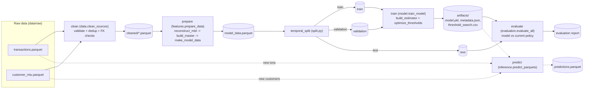

# Pipeline Diagram

## Stages

- **clean** (`data.py::clean_sources`) — validates schemas/foreign keys, dedups, and removes nils from the raw `transactions` and `customer_mtu` tables.
- **prepare** (`features.py::prepare_data`) — reconstructs `mtu_ratio` from `mtd_volume_before_mxn` (`reconstruct_mtd`), joins the tables into a master frame (`build_master`), and derives the model-ready `model_data.parquet` (`make_model_data`).
- **split** (`split.py::temporal_split`) — splits `model_data` into train/validation/test by time, so no future transaction leaks into training.
- **train** (`model.py::train_model`) — fits the estimator (`build_estimator`) on `train`, then picks decision thresholds against `validation` (`evaluation.py::optimize_thresholds`); estimator + metadata are persisted under `artifacts/`.
- **evaluate** (`evaluation.py::evaluate_all`) — scores `test` with the saved model and compares the resulting policy actions against the current rule-based policy (`current_policy_actions` / `mtu_policy_actions`).
- **predict** (`inference.py::predict_parquets`) — separate, on-demand path: loads the saved model and scores fresh transactions/customers parquet files directly, without going through the train/evaluate split.

`run-all` in `cli.py` chains clean → prepare → train → evaluate.
