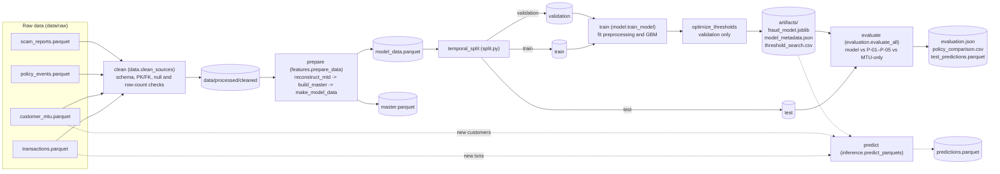

# Pipeline Diagram

## Stages

- **clean** (`data.py::clean_sources`) — validates all four raw tables, including schemas, expected row counts, primary/foreign keys, required nulls, exact duplicates, and timestamp precision. Contract violations stop the pipeline; required nulls are not silently removed.
- **prepare** (`features.py::prepare_data`) — reconstructs and validates `mtd_volume_before_mxn`, calculates guarded ratios, joins all four tables into `master.parquet`, applies the feature allowlist, and writes `model_data.parquet`.
- **split** (`split.py::temporal_split`) — deterministically splits `model_data` into train (weeks 9–21), validation (22–23), and test (24–26). It persists row-ID manifests and SHA-256 checksums.
- **train** (`model.py::train_model`) — fits train-only median imputation, stable missing indicators, class weighting, and the gradient-boosted classifier with `random_state=42`.
- **threshold selection** (`evaluation.py::optimize_thresholds`) — chooses peso-risk warning and delay thresholds only on validation and records deployment guardrails.
- **evaluate** (`evaluation.py::evaluate_all`) — scores untouched test rows and compares the proposed model with both the current P-01–P-05 policy and the MTU-only baseline using identical business assumptions.
- **predict** (`inference.py::predict_parquets`) — separate, on-demand path: loads the saved model and scores fresh transactions/customers parquet files directly, without going through the train/evaluate split.

`run-all` in `cli.py` chains clean → prepare → train → evaluate.
